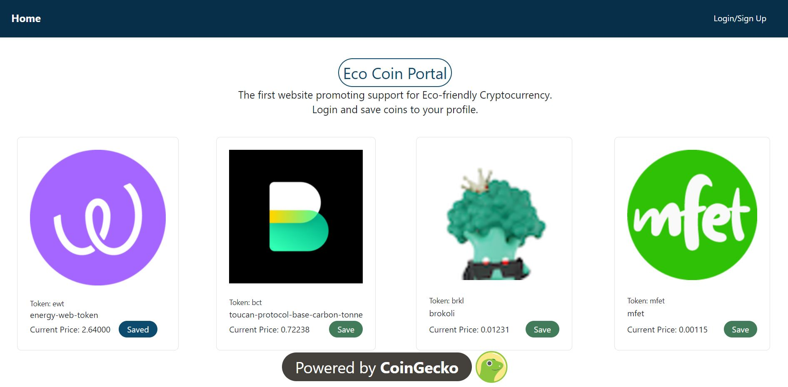
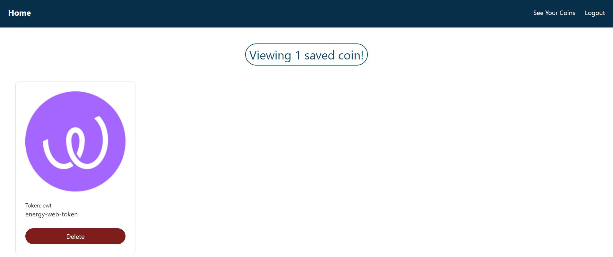

# Eco Crypto Portal 

## Description

Eco Crypto Portal lets the user view their favorite eco friendly cyrptocurrencies on a fully responsive website. The user will be able to sign up or log into their account using JWT Authentication to view their profile of favorite eco friendly cryptocurrencies. Users will be able to view the market data of their chosen coins on their saved coins page. This information is saved in a MongoDB database which allows for applications at scale. On the Heroku deployed application, the user can install a PWA on their local device with service worker technology.

### User Story

As a user I want to see tabular data about eco-friendly cryptocurrnecies
I want to add coins to watch on my dashboard and see three data points about chosen coins
So that I can keep track of my favorite eco-friendly crytocurrencies.

### Acceptance Criteria

Given the MERN FullStack web application
WHEN I Signup and login
THEN I am presented with a list of coins to watch
WHEN I click on the desired coins they are added to my dashboard
THEN I can navigate to my dashboard and see my coins
WHEN I hover over my selected coins
THEN I can see three data points about the coin

## Table of Contents

- [Installation](#installation)
- [Usage](#usage)
- [Badges](#badges)
- [Contribution](#contribution)
- [License](#license)
- [Contact](#contact)

---

## Installation

No installation required. If github installation is desired, it can be found at: https://github.com/arishorts/earth-coins. Install with the following steps:<br>

1. Start by opening a terminal or command prompt and navigating to the directory where the code is located.<br>
2. Run 'npm i' and 'npm run install' to install the required packages at the root level and client/server.<br>

```
npm i
npm run install
```

3. Run 'npm run develop' to start the server and run the application

```
npm run start
```

4. Finally, the respective page will display in your browser

---

## Usage

The website uses authentication and authorization to allow users to save and delete coins to their profile.
<br>
The website can be found at: https://ecocoinportal.herokuapp.com/


<br>


## Badges

<br>
<br>


## How_to_Contribute:

If you would like to contribute, refer to the [Contributor Covenant](https://www.contributor-covenant.org/)

---

## License

MIT: http://choosealicense.com/licenses/mit/

---

## Contact

Please reach out to arieljschwartz@gmail.com, joey.tranvik@gmail.com, TEXT, or TEXT if you have any questions.
